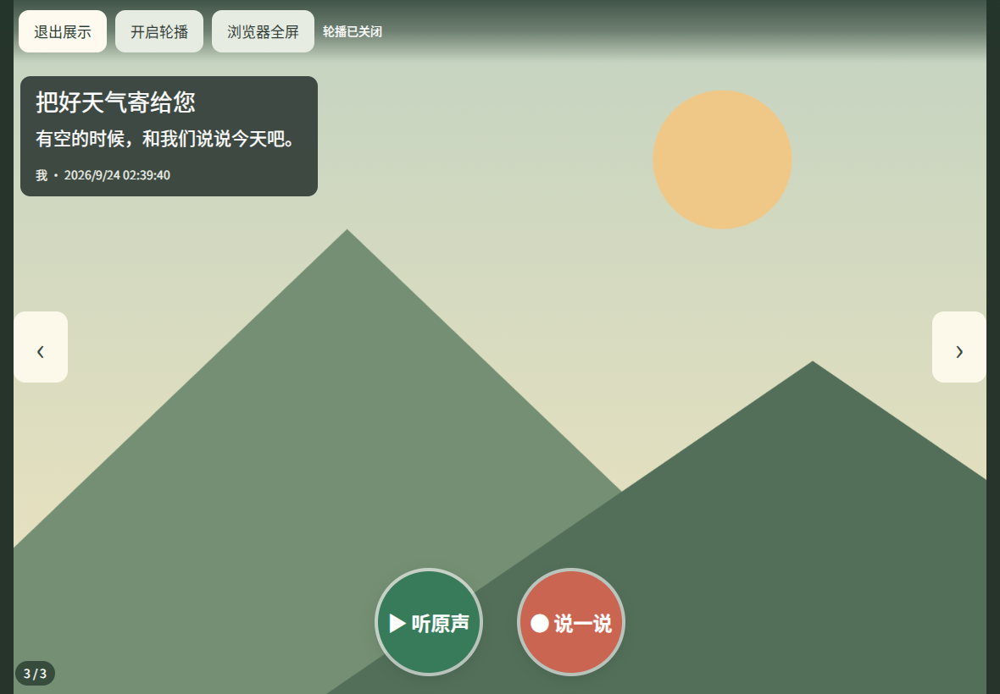
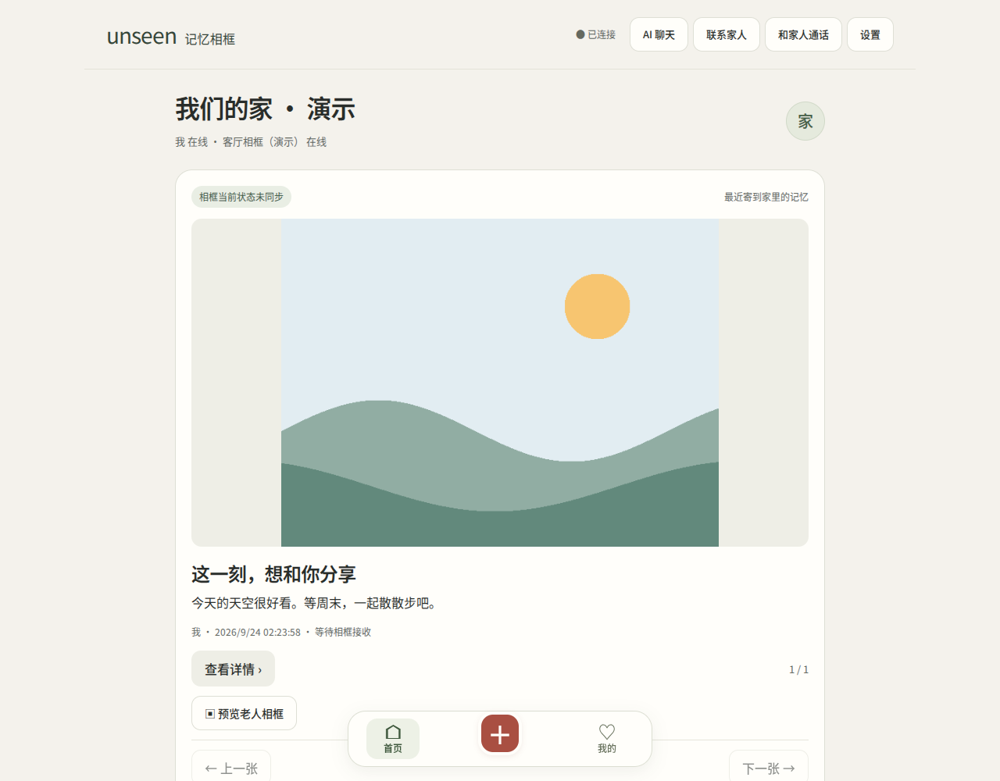

# unseen 记忆相框

把家人的照片、原声和故事送到长辈身边。手机端负责记录与管理，平板端专注看照片、听原声、说一说；AI 帮助聊天和整理回忆，发送内容仍由用户确认。

这是比赛展示用的独立源码仓库，只包含记忆相框主流程。仓库没有预置线上账号、真实家庭内容、云密钥或原服务访问地址，也不包含完整 UNSEEN 产品与开发仓库历史。

## 主要流程

1. 家人在 `/family` 注册并创建家庭，邀请另一位家人加入。
2. 通过底部中央 `＋` 发送照片、文字或原声；首页、`＋`、我的顺序固定。
3. 老人平板在 `/frame` 使用相框邀请配对，点“放大相框”进入展示：侧边翻页、可选轮播，绿色“听原声”和暖红色“说一说”。轮播默认关闭，录音、播放、聊天或弹窗期间暂停。
4. 开启已配置的 AI 后，可以围绕当前照片聊天，或整理录音。留言和联系建议先展示确认卡片；站内联系提醒不等于电话。
5. 可选 Windows Link 2 传感器把驻足事件发给 API。服务端把事件绑定到目标家庭和相框、短期保留并去重，相框端在合适时机展示邀请。老人确认后，AI 围绕这次邀请固定的照片读取可见内容并温和地问一句；读图失败时保留普通聊天入口，不自动开麦、录音或发出原声。



点“退出展示”回到普通相框，再从“更多”打开照片聊天、3D 空间、家人联系和设备设置。退出展示不会解除家庭配对。家人端保留“首页 / 中央＋ / 我的”，使用统一的米白、墨色和绿色操作样式。



界面截图来自隔离本地 HTTP 与 Chrome 测试，使用合成图片；不代表实体 Link 2 或真人语音已验收。

影石时光舱支持作品分享链接导入，包括使用新 `p1-app.insta360.com` 资源域名的作品；仍逐次校验域名、DNS 与重定向，不能导入任意网站或把普通视频重建为 3D。

## 本地启动

需要 Node.js 20.19 或更新的受支持版本、pnpm。建议用 Node.js 24。根目录与 `server` 各有独立锁文件：

```sh
pnpm install --frozen-lockfile
pnpm --dir server install --frozen-lockfile
node scripts/verify-release.mjs
node server/server.js
```

打开 [家人端](http://127.0.0.1:8787/family) 和 [相框端](http://127.0.0.1:8787/frame)。首次启动后，本机开通码在 `.data/setup-code`，只在“创建家庭”时填写。账号自行注册，测试中的 `fixture*` 账号只存在于临时测试数据中，不能用于登录应用。数据目录 `.data` 不进 Git；一个目录只运行一个本地实例。

无 AI 密钥时可以完成家庭、照片发送、相框配对和回执流程；AI 按钮会明确提示缺少配置。可上传 `server/public/assets/demo.png` 这张代码生成的中性演示图。仓库不附真实家庭照片、录音或 3D 模型。

在非本机设备上录音需要 HTTPS。把应用部署到自己的 HTTPS 域名后再用手机和平板配对；手机上的 `127.0.0.1` 不会指向电脑。

## 配置与部署

[部署指南](docs/DEPLOYMENT.md) 说明 CloudBase 数据库、存储、函数和密钥配置；[环境变量示例](.env.example) 只含空值与通用占位符。不会部署到原项目环境。`cloudbaserc.example.json` 必须改成自己的环境和角色后才能使用。

实时语音默认关闭。需要该能力时先执行 `node scripts/prepare-trtc.mjs`，再按部署指南配置并验收服务。该脚本从官方 npm 获取固定版本并检查完整性；SDK 二进制不会被此仓库再次分发。普通文字/照片对话不需要 TRTC。

“联系家人”的站内提醒、“和家人语音通话”的 WebRTC 和“AI 实时语音”是不同功能。通话入口已接线，缺少服务配置时明确提示且不申请麦克风；见[通话配置与边界](docs/CALLS.md)。

## Windows Link 2 设备端

[设备源码与接入说明](devices/link2-windows/README.md) 提供采集器 C++、CMake、构建/启动 PowerShell、Node 上报器与隔离测试。它独立于网页服务运行：官方 Link SDK 与所需构建依赖由使用者自行准备，公开仓库不附 SDK、DLL、EXE、私有配置或原交付压缩包。接入前确认 [来源及使用条件](devices/link2-windows/UPSTREAM.md)。

为每台相框单独配对、签发绑定目标的传感器令牌，再在 Windows 设备的私有配置中填写自己的 HTTPS `/api` 地址、设备标识和令牌。传感器使用独立凭据，不能拿家人账号会话替代；公开示例端点是不可连接的占位符。设备令牌及原始交付包不能上传到比赛仓库。

展示时先发送一张照片到已配对相框，再启动对应设备，等待驻足邀请并由老人确认。照片轮换后仍只围绕该邀请固定的照片开场；没有照片、页面忙碌或条件不满足时不会强行开始。实体 Link 2、Windows 采集器与平板的完整硬件联调仍需现场验收，源码、替身测试与本地 HTTP 验证不能替代这一项。

## 验证

```sh
node --test test/*.test.js
node --test devices/link2-windows/test/*.test.cjs
```

默认测试使用隔离临时数据、网络或音频替身，不会创建云家庭或调用付费模型。安装了 `server` 依赖后应执行 CloudBase SDK 的序列化测试；没有浏览器环境时浏览器项会明确显示 `SKIP`。如需执行浏览器项，安装 Playwright 并设置 `AI_UX_PLAYWRIGHT` 为 Playwright 模块绝对路径、`AI_UX_CHROME` 为 Chrome 可执行文件绝对路径后重新运行。测试输出中的通过/跳过数量是本次运行的事实，不预写历史数量。

[家人和相框使用指南](docs/FAMILY-QUICKSTART.md) · [确认后 AI 开场](docs/PRESENCE-PROACTIVE-AI.md) · [架构与数据边界](docs/ARCHITECTURE.md) · [驻足上报协议](docs/PRESENCE-CLOUD-API.md) · [能力与验收边界](docs/CAPABILITIES.md) · [第三方与素材说明](THIRD-PARTY-NOTICES.md)

`SANITIZATION-REPORT.json` 记录文件范围和敏感模式检查结果；`SHA256SUMS` 记录初始发布文件摘要。校验清单不是数字签名。公开可见不自动为原创代码授予开源许可，第三方组件按各自许可证使用。
