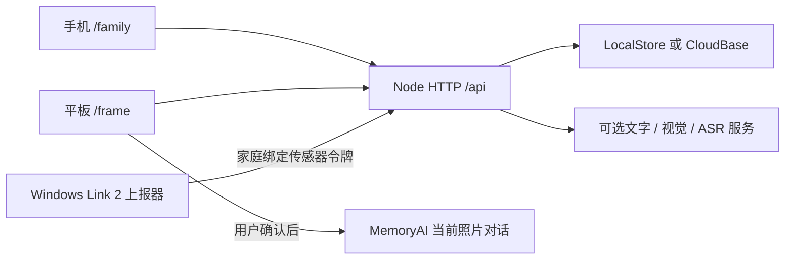

# 架构与数据边界

- `server/server.js`：HTTP、静态资源、`/api` action 路由、会话与家庭边界。
- `server/store.js`：本地 JSON/媒体存储与 CloudBase 记录、云媒体适配。云集合为 `memory_demo_records`，客户端不能直接读写。
- `server/accounts.js`：账号、盐化密码派生、家庭邀请、会话撤销和限流。
- `server/public/`：原生 HTML/CSS/JavaScript，同一入口按家人/相框角色展示，无前端构建步骤。
- `server/ai*`：文字、照片、录音转写、待确认行动及可选实时语音。供应商密钥留在服务端。
- `server/spatial*`：受限外链导入、防 SSRF、分段下载及摘要校验；浏览器使用 PlayCanvas 展示。
- `test/`：业务、权限、失效、去重、生命周期及可选浏览器测试。

驻足事件只携带事件与设备标识，不上传摄像头原始画面。传感器令牌权限仅限向绑定家庭上报；不能作为家庭登录会话。相框通过现有 `state` 轮询接收短时事件，前端检查去重、可见性和 AI 忙碌状态，老人确认后才开始聊天。具体字段与时限以同版本 presence 模块、协议文档及测试为准。

照片和原声通过家庭鉴权访问。3D 仍为每段权限检查、4 MiB 分段与整文件 SHA256 验证，不能用单次大响应或长期签名 URL 绕过。隐私数据和 `.data` 从不属于源码发布内容。
